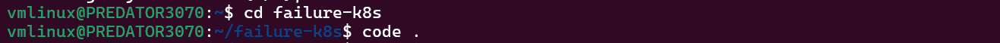
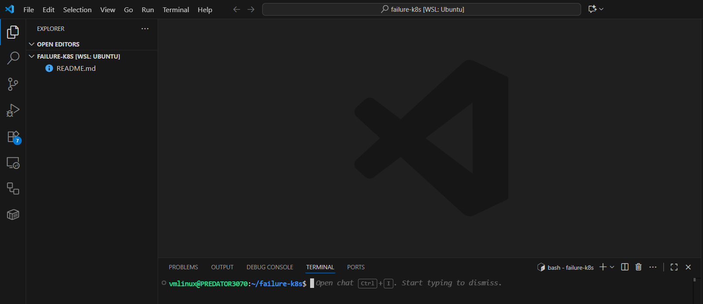
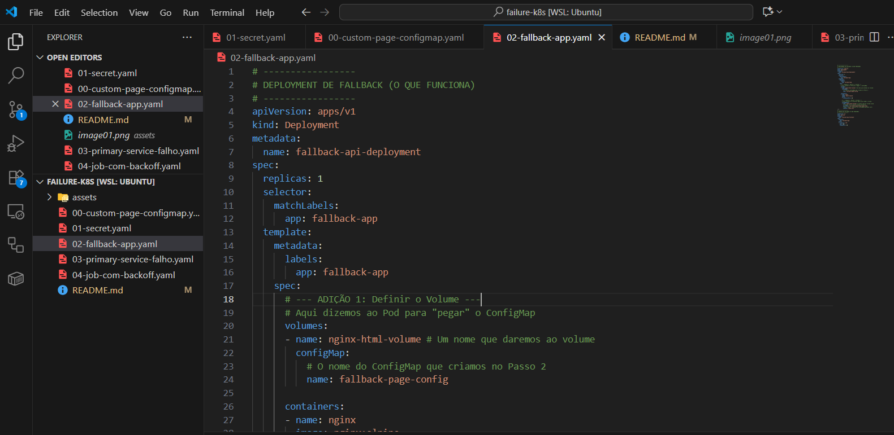
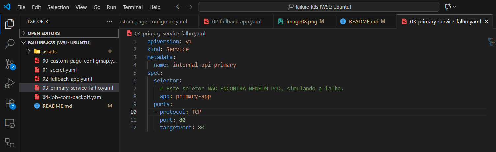
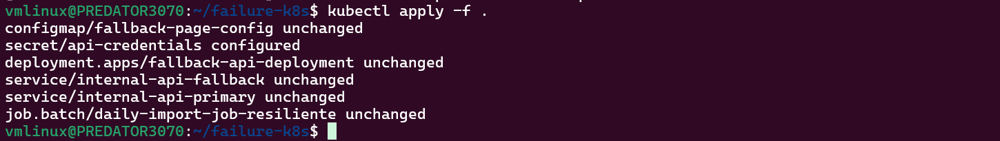
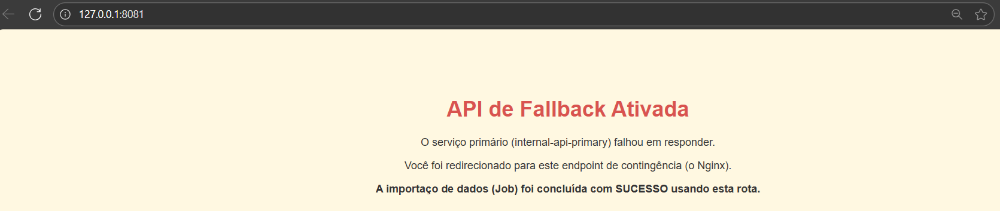

# Simulação de Falha e Resiliência de Job/Endpoint no Kubernetes (KIND)

Este repositório contém os arquivos e a documentação de uma simulação de falha de serviço no Kubernetes, executada localmente com KIND no WSL Ubuntu.

## Resumo do Projeto

O objetivo deste projeto é simular um cenário de falha crítica (como a queda de uma região da AWS) onde um `Job` (processo em lote, ex: importação diária) perde acesso ao seu endpoint primário e precisa executar uma estratégia de resiliência para garantir a conclusão da tarefa.

Implementamos uma solução que utiliza:
1.  **Retry com Backoff:** O Job tenta se conectar ao serviço primário 3 vezes, com uma espera crescente (5s, 10s), dando tempo para o serviço se recuperar de falhas temporárias.
2.  **Fallback:** Após as tentativas falharem, o Job aciona automaticamente um "Plano B", conectando-se a um endpoint de contingência (fallback).
3.  **ConfigMap:** O endpoint de fallback serve uma página HTML customizada para confirmar visualmente que a rota de contingência foi usada.

## Cenário do Desafio

* **Aplicação:** Um `Job` crítico de importação de dados.
* **Dependências:** O `Job` precisa de um `Secret` (com chaves de API) e de um `Service` (endpoint interno) para funcionar.
* **A Falha:** O endpoint primário (`internal-api-primary`) fica inacessível.
* **A Solução:** O `Job` deve detectar a falha, tentar se reconectar (backoff) e, por fim, usar um endpoint de fallback (`internal-api-fallback`) para concluir a tarefa com sucesso.

## Tecnologias Utilizadas

* **Docker Desktop** (com integração WSL)
* **WSL 2** (Ubuntu)
* **KIND** (Kubernetes in Docker)
* **Kubectl**
* **VSCode** (para edição dos YAMLs)

---

## Como Executar (Passo a Passo)

Siga estes passos para replicar a simulação no seu ambiente WSL.

### Pré-requisitos

1.  **Docker Desktop com WSL 2:**
    É fundamental ter o Docker Desktop instalado no Windows e integrado com sua distribuição WSL (Ubuntu).
    * Vá em `Settings > Resources > WSL Integration`.
    * Habilite a integração com sua distro Ubuntu.
    * Clique em `Apply & Restart`.

    

2.  **KIND (Kubernetes in Docker):**
    Instale o KIND (Kubernetes in Docker) dentro do seu terminal WSL Ubuntu.

    ```bash
    # 1. Baixar o binário
    curl -Lo ./kind https://kind.sigs.k8s.io/dl/v0.30.0/kind-linux-amd64
    
    # 2. Tornar executável
    chmod +x ./kind
    
    # 3. Mover para o PATH
    sudo mv ./kind /usr/local/bin/kind
    
    # 4. Verificar a instalação
    kind version
    ```
    
    

### Passo 0: Criar o Cluster KIND

Crie um cluster de Kubernetes local chamado `failure-k8s`.

```bash
kind create cluster --name failure-k8s
```


Passo 1: Clonar o Repositório
Obtenha todos os arquivos YAML necessários clonando este repositório.

Bash

# Clona o repositório
git clone [https://github.com/Robelio-cloud/failure-k8s.git](https://github.com/Robelio-cloud/failure-k8s.git)
 


# Acessa o diretório do projeto
cd failure-k8s

Dentro do diretório failure-k8s abrir o VScode para criação dos arquivos YAML:

code . 







## 00-custom-page-configmap.yaml
Criar o ConfigMap com o HTML customizada API de Fallback Ativada, substituindo a página padrão do Nginx

```bash
apiVersion: v1
kind: ConfigMap
metadata:
  name: fallback-page-config
data:
  # Este será o nome do arquivo (index.html)
  # O | indica que o que vem abaixo é um bloco de texto multi-linha
  index.html: |
    <!DOCTYPE html>
    <html lang="pt-br">
    <head>
        <title>Sistema de Contingência</title>
        <style>
            body { 
                font-family: Arial, sans-serif; 
                text-align: center; 
                margin-top: 100px; 
                background-color: #fff8e1; /* Um amarelo claro de "alerta" */
                color: #333;
            }
            h1 { 
                color: #d9534f; /* Vermelho */
            }
        </style>
    </head>
    <body>
        <h1>API de Fallback Ativada</h1>
        <p>O servi&ccedil;o prim&aacute;rio (internal-api-primary) falhou em responder.</p>
        <p>Voc&ecirc; foi redirecionado para este endpoint de conting&ecirc;ncia (o Nginx).</p>
        <p><strong>A importa&ccedil;o de dados (Job) foi conclu&iacute;da com SUCESSO usando esta rota.</strong></p>
    </body>
    </html>
```


## 01-secret.yaml
Este é o Secret que o Job precisa acessar.


```bash
apiVersion: v1
kind: Secret
metadata:
  name: api-credentials
type: Opaque
stringData:
  # Chave de API fictícia que o job usará
  API_KEY: "secret-key-para-importacao-123456"
```


## 02-fallback-app.yaml
Este é o Deployment e o Service de fallback (o que funciona).


```bash
# -----------------
# DEPLOYMENT DE FALLBACK (O QUE FUNCIONA)
# -----------------
apiVersion: apps/v1
kind: Deployment
metadata:
  name: fallback-api-deployment
spec:
  replicas: 1
  selector:
    matchLabels:
      app: fallback-app
  template:
    metadata:
      labels:
        app: fallback-app
    spec:
      # --- ADIÇÃO 1: Definir o Volume ---
      # Aqui dizemos ao Pod para "pegar" o ConfigMap
      volumes:
      - name: nginx-html-volume # Um nome que daremos ao volume
        configMap:
          # O nome do ConfigMap que criamos no Passo 2
          name: fallback-page-config 
      
      containers:
      - name: nginx
        image: nginx:alpine 
        ports:
        - containerPort: 80
        
        # --- ADIÇÃO 2: Montar o Volume ---
        # Aqui dizemos ao container Nginx para USAR o volume
        volumeMounts:
        - name: nginx-html-volume # O mesmo nome do volume acima
          # O Nginx serve arquivos deste diretório:
          mountPath: /usr/share/nginx/html/index.html
          # Qual "chave" (arquivo) do ConfigMap queremos usar:
          subPath: index.html 
---
# -----------------
# SERVICE DE FALLBACK (O QUE FUNCIONA)
# -----------------
apiVersion: v1
kind: Service
metadata:
  name: internal-api-fallback
spec:
  selector:
    app: fallback-app 
  ports:
  - protocol: TCP
    port: 80
    targetPort: 80
```




## 03-primary-service-falho.yaml
Este é o Service primário (que vai falhar). Note que criamos o Service, mas não há Deployment ou Pods com o label app: primary-app.

```bash
apiVersion: v1
kind: Service
metadata:
  name: internal-api-primary
spec:
  selector:
    # Este seletor NÃO ENCONTRA NENHUM POD, simulando a falha.
    app: primary-app 
  ports:
  - protocol: TCP
    port: 80
    targetPort: 80
```




## 04-job-com-backoff.yaml 
Note como a seção args: do container inclui a lógica de loop, sleep (backoff) e retry antes de finalmente tentar o fallback.

```bash
apiVersion: batch/v1
kind: Job
metadata:
  name: daily-import-job-resiliente
spec:
  backoffLimit: 0
  template:
    spec:
      containers:
      - name: import-worker-with-backoff
        image: curlimages/curl:latest 
        
        command: ["/bin/sh", "-c"]
        args:
          - |
            # --- Configuração da Estratégia ---
            PRIMARY_URL="http://internal-api-primary"
            FALLBACK_URL="http://internal-api-fallback"
            MAX_ATTEMPTS=3
            BASE_SLEEP_SECONDS=5 # Base para o backoff (5s, 10s, 15s)
            
            echo "[$(date)] Job de importação (com backoff) iniciado."
            echo "[$(date)] Chave API carregada (log): ${MY_API_KEY:0:10}..." # Log parcial da chave
            
            # --- Lógica de Retry/Backoff no Primário ---
            success=false
            
            # Tenta executar o loop MAX_ATTEMPTS vezes (ex: 3 vezes)
            for i in $(seq 1 $MAX_ATTEMPTS); do
              echo "[$(date)] Tentativa $i/$MAX_ATTEMPTS: Acessando primário ($PRIMARY_URL)..."
              
              # 'if curl...' só executa o 'then' se o curl retornar código 0 (sucesso)
              if curl -sf --connect-timeout 5 $PRIMARY_URL; then
                echo "[$(date)] SUCESSO: Conexão primária bem-sucedida na tentativa $i."
                success=true
                break # Sai do loop 'for' com sucesso
              fi
              
              # Se chegou aqui, o curl falhou.
              
              # Se não for a última tentativa, aplica o backoff
              if [ $i -lt $MAX_ATTEMPTS ]; then
                sleep_time=$((i * BASE_SLEEP_SECONDS)) # Backoff linear: 1*5s, 2*5s=10s...
                echo "[$(date)] FALHA (Tentativa $i): Primário inacessível. Aguardando $sleep_time segundos (backoff)..."
                sleep $sleep_time
              fi
            done
            
            # --- Verificação Pós-Loop ---
            
            # Se o loop terminou com sucesso, encerra o Job com sucesso
            if [ "$success" = "true" ]; then
              echo "[$(date)] Job concluído com SUCESSO (via primário)."
              exit 0
            fi
            
            # --- Lógica de Fallback (só executa se o loop falhar 3x) ---
            
            echo "[$(date)] FALHA GERAL (Primário): Endpoint $PRIMARY_URL inacessível após $MAX_ATTEMPTS tentativas."
            echo "[$(date)] ACIONANDO FALLBACK para $FALLBACK_URL..."
            
            if curl -sf --connect-timeout 5 $FALLBACK_URL; then
              echo "[$(date)] SUCESSO: Dados importados via endpoint de FALLBACK."
              exit 0
            else
              echo "[$(date)] FALHA GERAL (Primário E Fallback): Todos os endpoints falharam."
              exit 1
            fi

        # ------------------------------------
        # CORREÇÃO AQUI: 'env:' está agora
        # DENTRO de 'containers:'
        # ------------------------------------
        env:
          # Injeta o Secret como variável de ambiente
          - name: MY_API_KEY
            valueFrom:
              secretKeyRef:
                name: api-credentials
                key: API_KEY
      
      # 'restartPolicy' fica no nível do 'spec'
      restartPolicy: Never
```


Passo 2: Aplicar os Recursos da Simulação
Agora, aplique todos os arquivos YAML (o ConfigMap, o Secret, os Serviços e o Job) no seu cluster de uma só vez.


kubectl apply -f .

Saída Esperada:

configmap/fallback-page-config created
secret/api-credentials configured
deployment.apps/fallback-api-deployment created
service/internal-api-fallback created
service/internal-api-primary created
job.batch/daily-import-job-resiliente created





Verificando a Simulação (As Evidências)
Com os recursos aplicados, o Job iniciará imediatamente. Vamos verificar os resultados.

# Evidência 1: Logs do Job (Backoff + Fallback)
Esta é a evidência principal. O log do Job nos mostrará a falha, as tentativas de backoff e o sucesso final via fallback.

Encontre o nome do Pod do Job: O Kubernetes cria um pod para o job com um nome aleatório.

kubectl get pods
(Procure pelo pod que começa com daily-import-job-resiliente-... e status Running ou Completed).


Veja os Logs: Use o nome do pod encontrado para ver os logs. O comando -f (follow) permite ver os logs ao vivo.


# Substitua 'daily-import-job-resiliente-dqmvf' pelo nome do seu pod
kubectl logs -f daily-import-job-resiliente-dqmvf 
Resultado do Log (Sucesso): O log mostrará:

O Job iniciando.

A Tentativa 1 falhando e o script aguardando 5 segundos.

A Tentativa 2 falhando e o script aguardando 10 segundos.

A Tentativa 3 falhando, levando à falha geral do primário.

O ACIONANDO FALLBACK.

O curl imprimindo o HTML da nossa página customizada ("Sistema de Contingência").

A mensagem final de SUCESSO.


Abra um novo terminal WSL.

Execute o kubectl port-forward. Usamos a porta local 8081 (pois a 8080 pode estar em uso).

```bash
kubectl port-forward service/internal-api-fallback 8081:80
```

Saída Esperada:

Forwarding from 127.0.0.1:8081 -> 80
Forwarding from [::1]:8081 -> 80
Abra seu navegador: Acesse http://localhost:8081. 
Você verá a página "API de Fallback Ativada", confirmando que o serviço de contingência está no ar e servindo o HTML customizado. 





# Arquitetura dos Arquivos YAML

00-custom-page-configmap.yaml: Cria um ConfigMap que armazena nosso index.html customizado de "Sistema de Contingência".

01-secret.yaml: Cria o Secret api-credentials com uma chave API_KEY fictícia.

02-fallback-app.yaml: Cria o Deployment (Nginx) e o Service para o endpoint de fallback (internal-api-fallback). Este arquivo é modificado para montar o ConfigMap e substituir a página padrão do Nginx pela nossa.

03-primary-service-falho.yaml: Cria o Service do endpoint primário (internal-api-primary). Crucialmente, ele não tem Deployment ou Pods associados, garantindo que qualquer conexão com ele falhe.

04-job-com-backoff.yaml: O coração da simulação. Cria o Job que executa um script shell, monta o Secret como variável de ambiente e contém toda a lógica de retry/backoff/fallback.